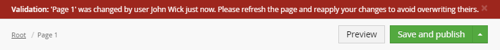

# uConcur

An overwrite blocking plugin for Umbraco (7.4.0+) started at [Affinity ID](http://www.affinityid.co.nz).  

Currently in internal testing, will be released to public NuGet after that.

## Known issues

* Current version uses a simplified validation based on updated date (precise up to seconds).  
  So an overwrite is still possible in the following scenario:
  
      1. User A saves a document  
      2. User B opens a document (less than a second since 1)  
      3. User A saves a document (less than a second since 1)  
      4. User B saves a document, overwriting 3  
  
  This is something we're looking at fixing in a future version.
  
* The library integrates with Umbraco on a very low level, which might be unreliable between Umbraco releases.  
  Please include your Umbraco version in any reported issues.
